        # Automated Analysis Report

        ### Narrative Analysis of the Book Dataset

The dataset consists of **10,000 books** listed on Goodreads, providing a wealth of information about their ratings, authors, publication details, and user engagement. Key columns include the book ID, author names, publication years, average ratings, and the distribution of ratings across five categories (from 1 to 5). 

#### Key Observations

1. **Author Popularity**: The most frequent author in the dataset is **Stephen King**, noted for his wide reach and prolific writing. Understanding which authors have the most books in the dataset could reveal insights about authorship trends in various genres.

2. **Publication Trends**: The **original publication year** spans from **1750 to 2017**, indicating a diverse range of literature, including modern classics and contemporary works. While the dataset primarily represents recent publications (peaking around 2011), history lovers can find older titles, suggesting a growing interest in classics.

3. **Average Ratings & Rating Distribution**: The average rating across the dataset hovers around **4.00**, indicating a generally positive reception. Ratings appear positively skewed, with a substantial number of books receiving ratings of **4 and 5 stars**. For instance, the correlation matrix shows strong positive correlations between higher ratings and the counts of ratings received—this suggests that popular books are not only rated more frequently but also tend to receive high praise.

4. **Missing Values**: Notable missing values in columns such as **ISBN** and **ISBN13** point to a lack of standardization in book entries. The dataset contains considerable instances of missing **original titles** and **language codes**, suggesting a need for data cleaning or enhancement efforts.

5. **Engagement Metrics**: **Work ratings count** and related engagement metrics (like work text reviews) highlight the interactive aspect of reading, where readers actively participate in content evaluation through ratings and reviews. A significant number of ratings are associated with higher review counts, indicating that popular books spur reader engagement.

6. **Language Variation**: The **language code** column indicates that the dataset includes considerable English literature, but the presence of missing values highlights potential gaps in global literature representation. 

### Suggested Visualizations

1. **Bar Chart of Average Ratings by Authors**: This chart can visually represent how different authors stack up regarding average ratings, displaying Stephen King and other top authors prominently. It would allow for the identification of trends related to authors' popularity and performance.

2. **Histogram of Ratings Distribution**: A histogram showing the distribution of ratings across the dataset would vividly illustrate how ratings are dispersed. This visualization can reveal peaks at certain rating levels (especially at 4 and 5) and whether there are any notable gaps or skewness in rating behavior.

3. **Timeline of Original Publication Years**: A timeline visualization could depict the number of books published across decades, clarifying trends in book publication over time. This could illustrate shifts in literary production and highlight periods of significant publishing activity.

### Concluding Remarks

The dataset captures an engaging slice of literary culture, reflecting not only the literary canon but also the modern reader's interaction through ratings and reviews. The insights derived from this analysis could be instrumental in guiding further research into reading trends, author popularity, and the evolving landscape of book publishing.

        
        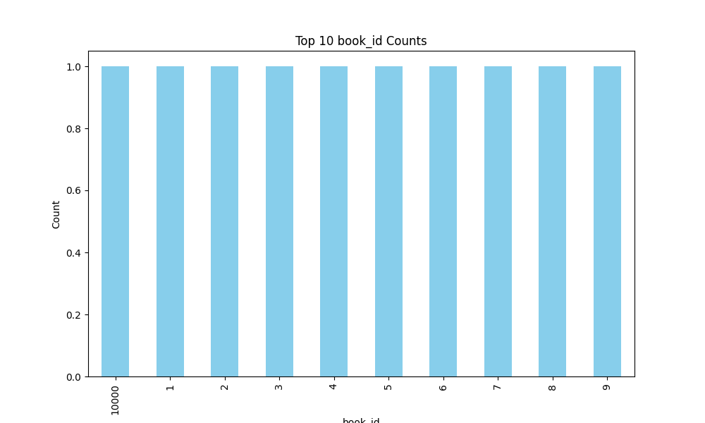
        
        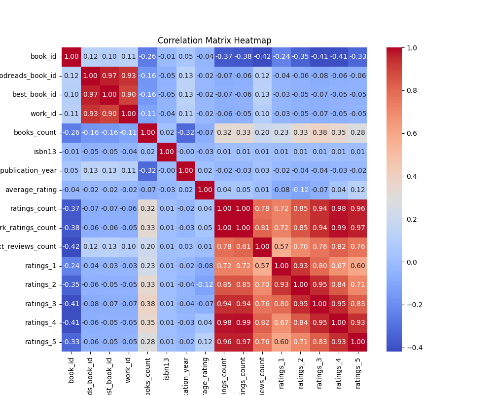
        
        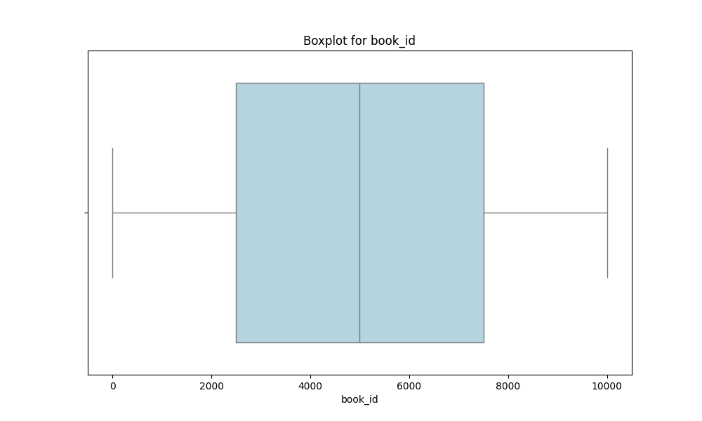
        
        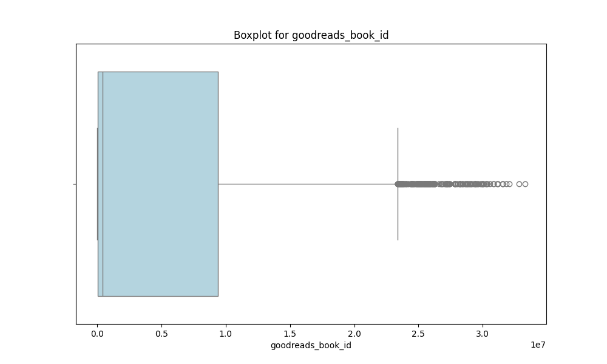
        
        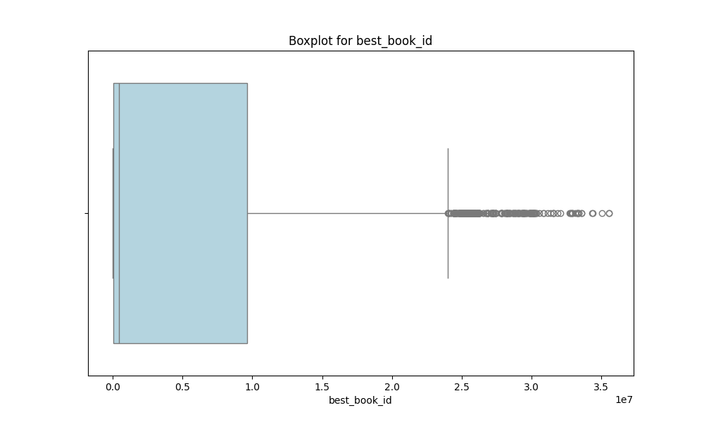
        
        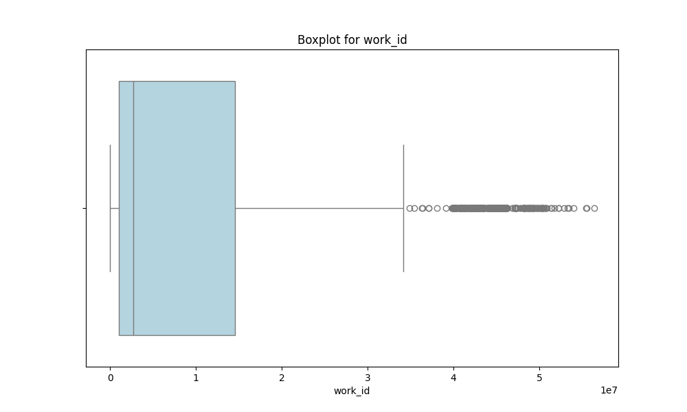
        
        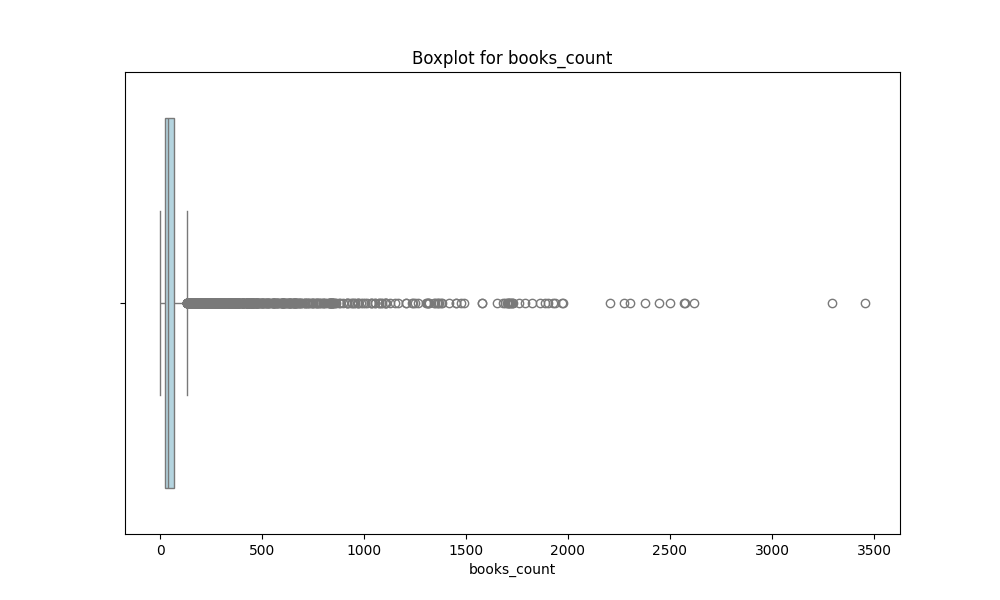
        
        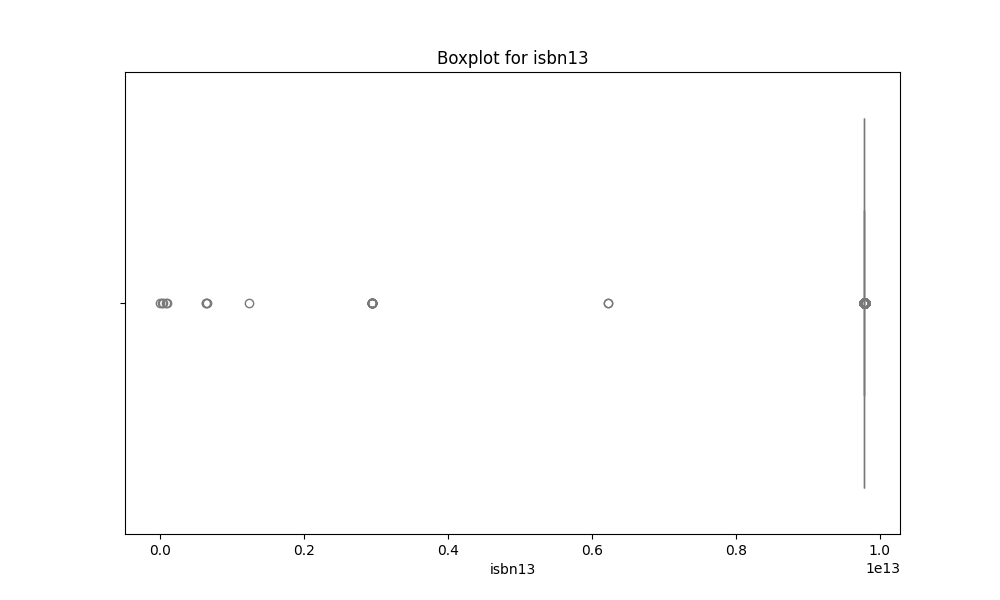
        
        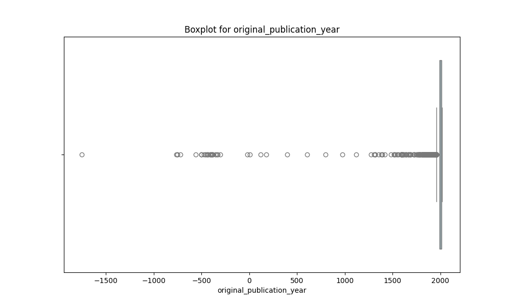
        
        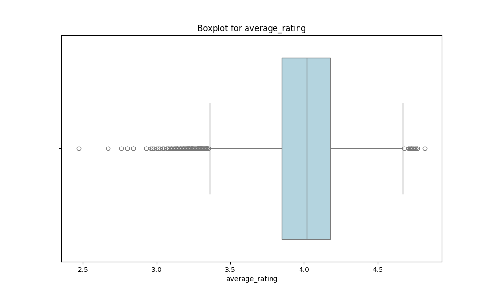
        
        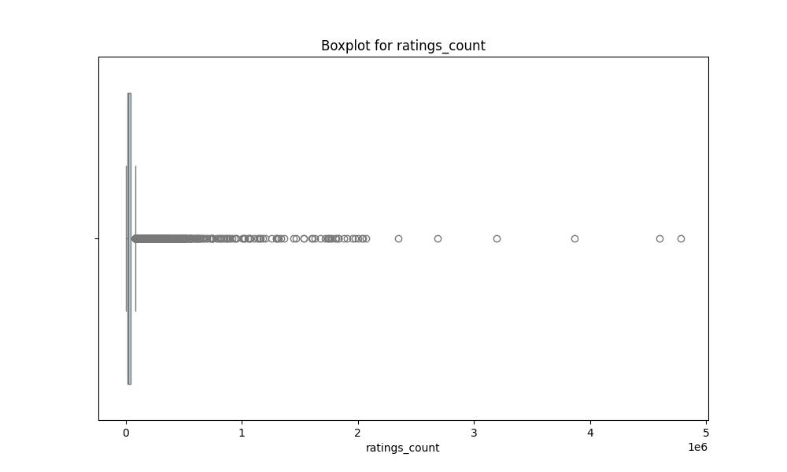
        
        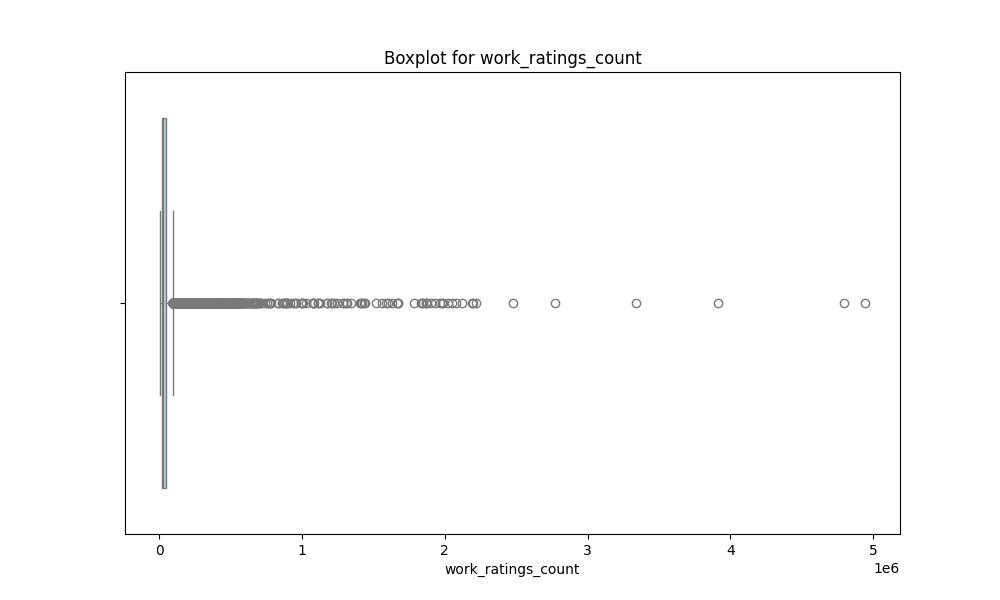
        
        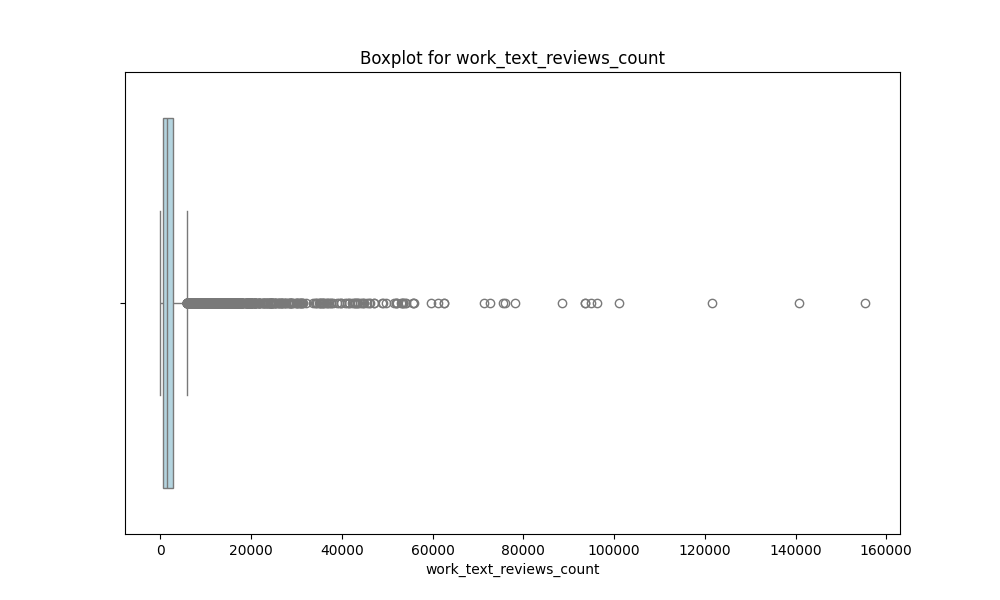
        
        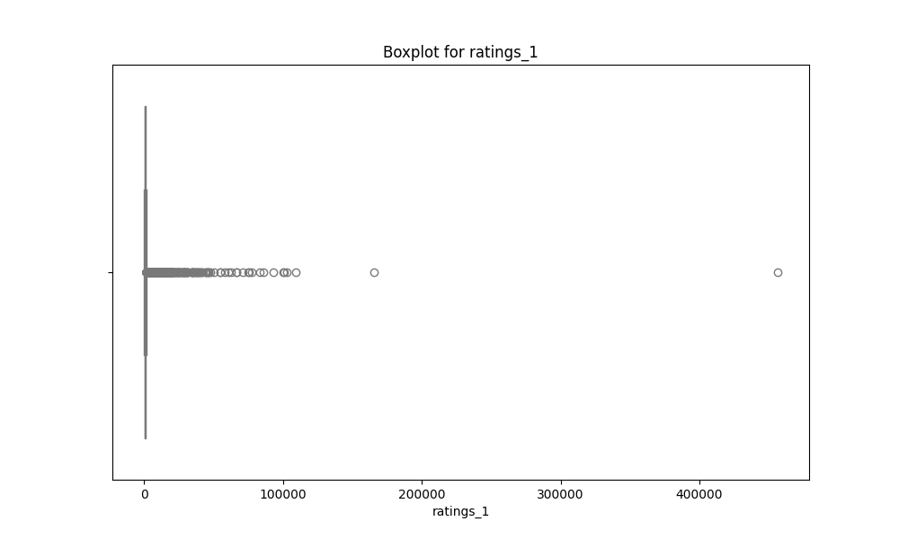
        
        
        
        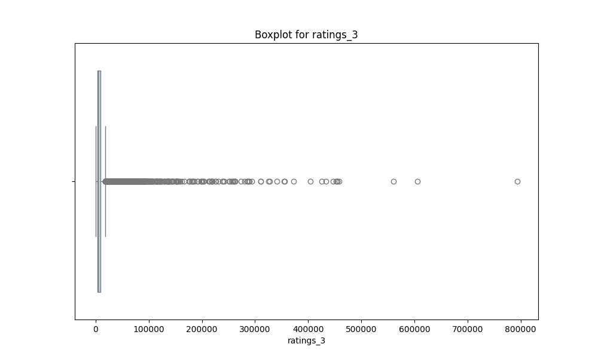
        
        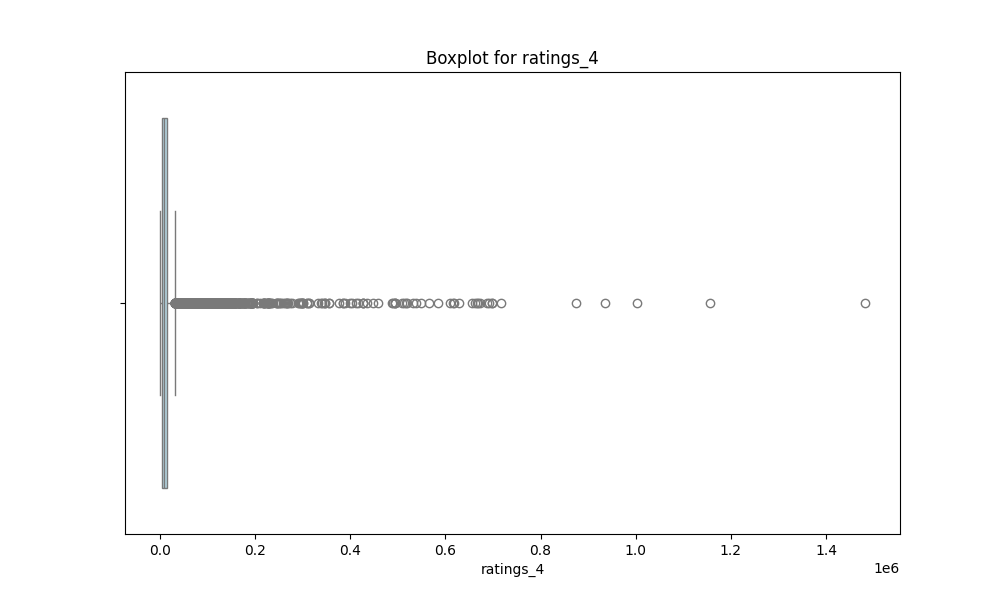
        
        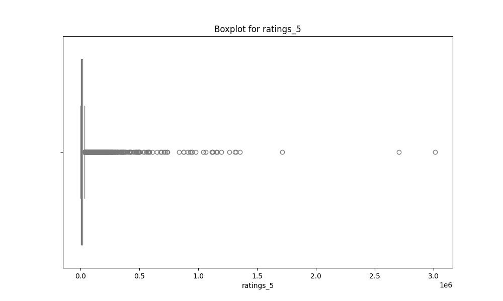
        
        