        # Automated Analysis Report

        ### Narrative Analysis of the Dataset

The dataset presents a rich tapestry of data related to subjective well-being (captured through the "Life Ladder" score) and various socio-economic factors across different countries and years. With 2363 entries covering 165 unique countries, the dataset provides a crucial glimpse into the interplay between economic prosperity, social support, health outcomes, and general life satisfaction from 2005 to 2023.

#### Key Insights:

1. **Economic Stability and Well-Being**:
   The correlation matrix reveals a significant positive relationship between "Log GDP per capita" and "Life Ladder" (0.783). This suggests that nations with higher GDP per capita tend to have citizens who report greater life satisfaction. It emphasizes the importance of economic factors in shaping individual happiness, highlighting a crucial pathway for policymakers aiming to enhance well-being.

2. **Role of Social Structures**:
   Strong correlations are also present between "Social support" (0.722) and "Life Ladder", and "Healthy life expectancy at birth" (0.715) and "Life Ladder". This indicates that social networks and health outcomes play pivotal roles in personal well-being. Countries that provide robust social support systems and promote health tend to foster happier populations.

3. **Emotional Well-Being**:
   The dataset captures dimensions of emotional experience, namely "Positive affect" (0.515) and "Negative affect" (-0.352) in relation to "Life Ladder". This underscores a nuanced interplay where positive sentiments enhance life satisfaction, whereas negative experiences detract from it. Understanding and improving these emotional states can be an essential aspect of public policy aimed at enhancing life quality.

4. **Freedom and Satisfaction**:
   The variable "Freedom to make life choices" (0.538) also shows a considerable correlation with life happiness. Societies that empower individuals to make choices reflect higher happiness levels, suggesting that autonomy is a critical component of subjective well-being.

#### Missing Data Considerations:
It's noteworthy that certain variables have considerable missing data. For example, "Generosity" has 81 missing entries, while "Perceptions of corruption" has 125. Addressing these gaps would be essential for a complete understanding of the relationships within the dataset.

### Suggested Visualizations

1. **Scatter Plot of GDP Per Capita vs. Life Ladder Score**:
   A scatter plot illustrating each country’s "Log GDP per capita" against its "Life Ladder" score could visually emphasize the strong correlation between economic status and well-being. This plot could also include regression lines to depict trends more clearly, segmented by country or region.

2. **Heatmap of Correlation Matrix**:
   A heatmap of the correlation matrix would succinctly display the relationships among variables, allowing for quick visual assessments of which factors most significantly influence life satisfaction. This would help identify potential areas for deeper investigation.

3. **Box Plot of Life Ladder Scores Across Regions**:
   This box plot could represent variations in "Life Ladder" scores across different continents or regions. It would provide insights into geographic disparities in well-being, revealing which regions are benefitting more from economic and social factors.

### Conclusion
This dataset provides a comprehensive view of the factors related to life satisfaction across varied countries over nearly two decades. It poses essential questions about the roles of economic prosperity, social structures, health, and emotional well-being in shaping human happiness. By leveraging visualizations, the insights drawn from this dataset can be communicated effectively, guiding stakeholders in policy formulation and strategic planning for enhancing quality of life.

        
        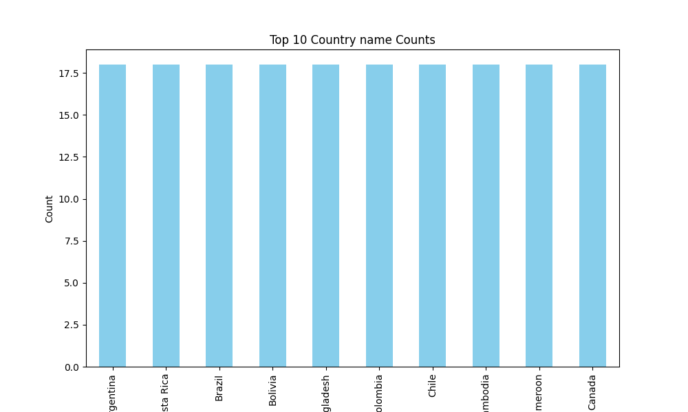
        
        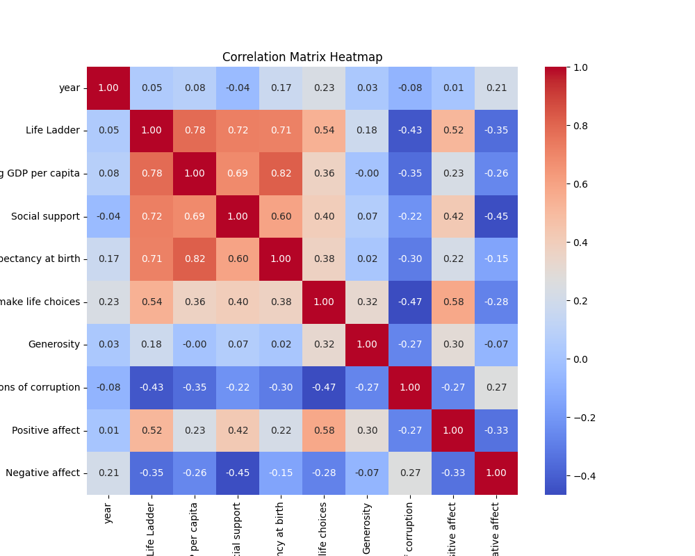
        
        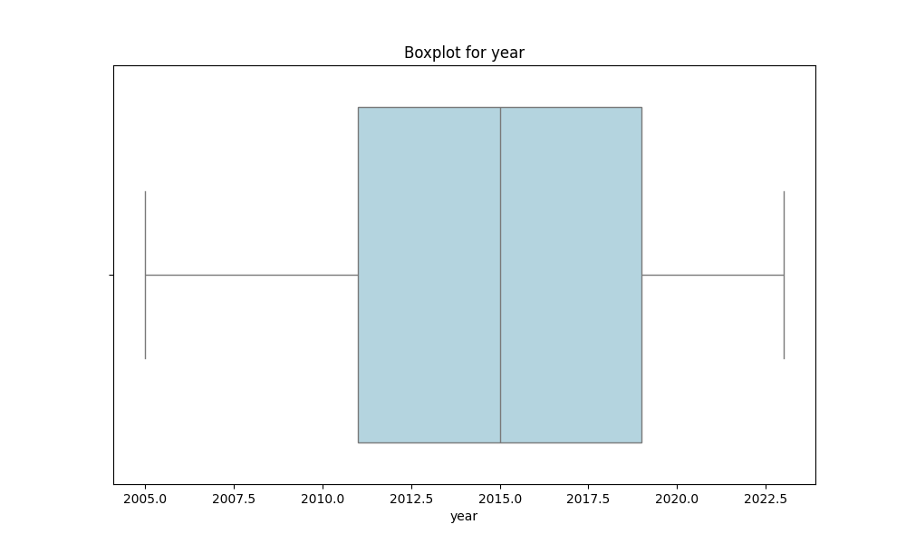
        
        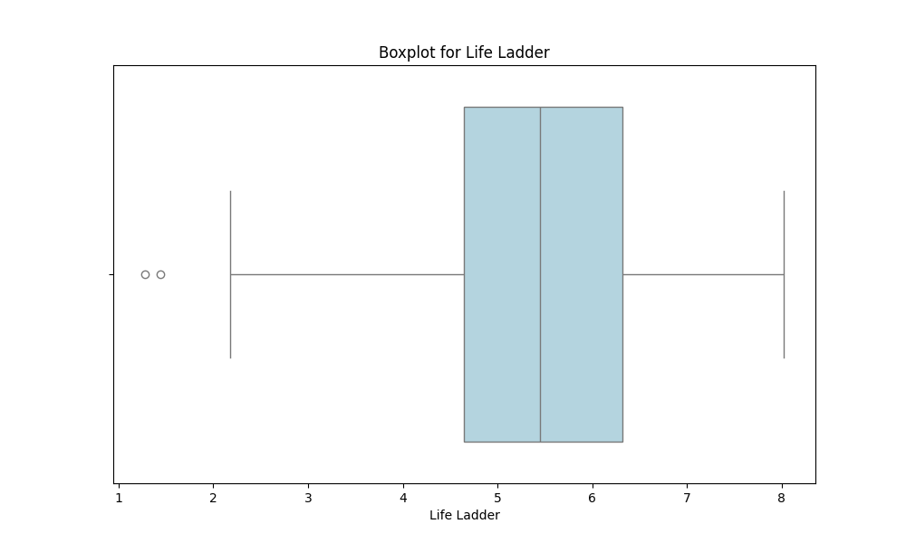
        
        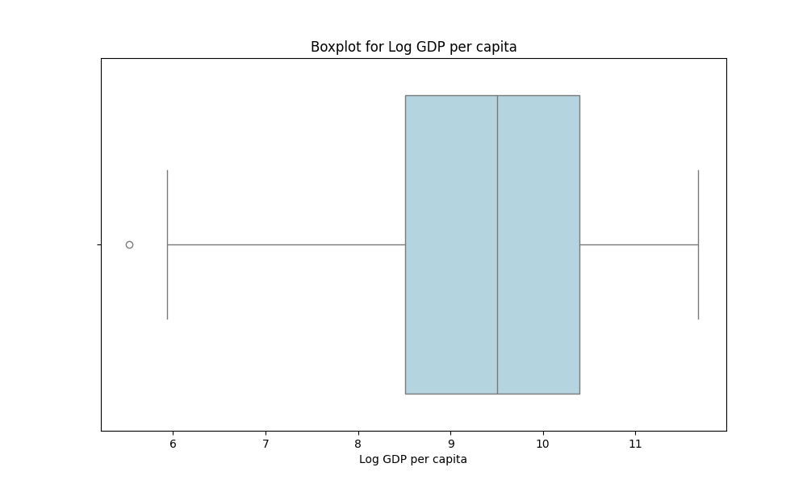
        
        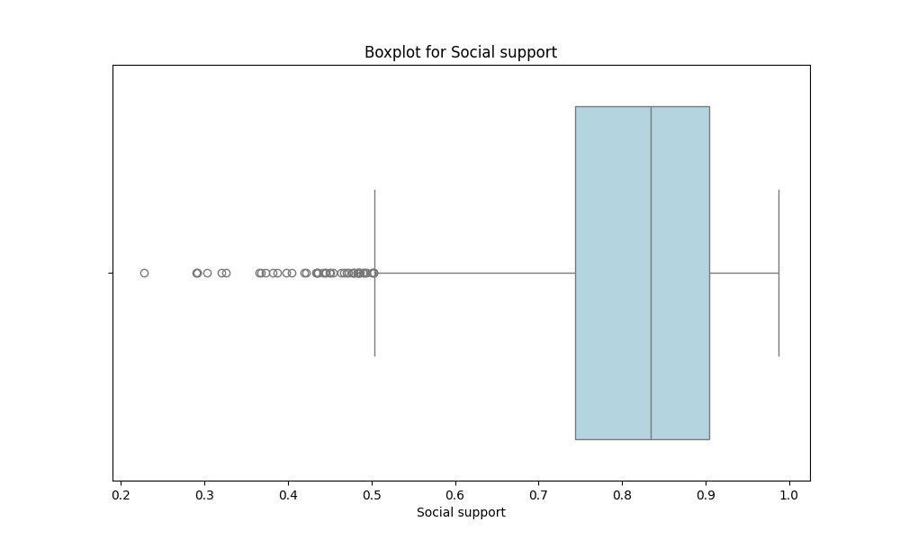
        
        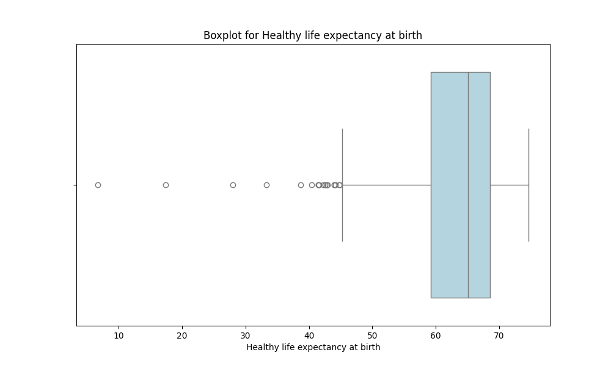
        
        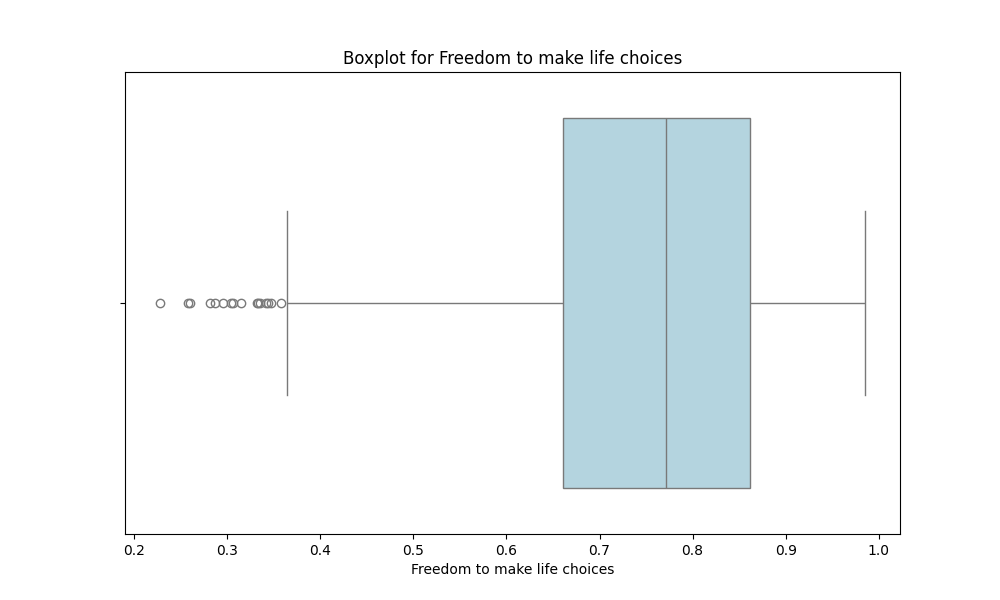
        
        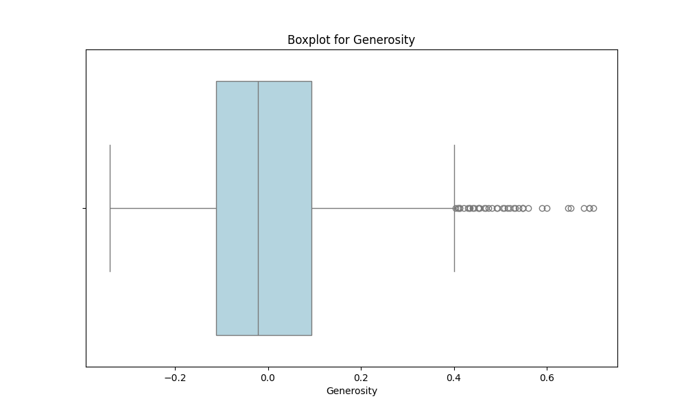
        
        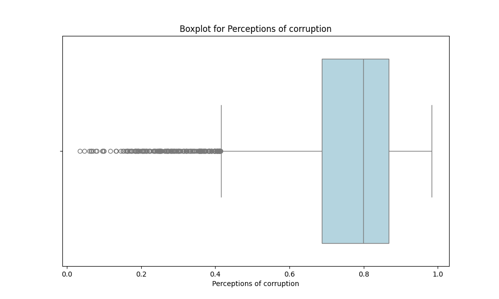
        
        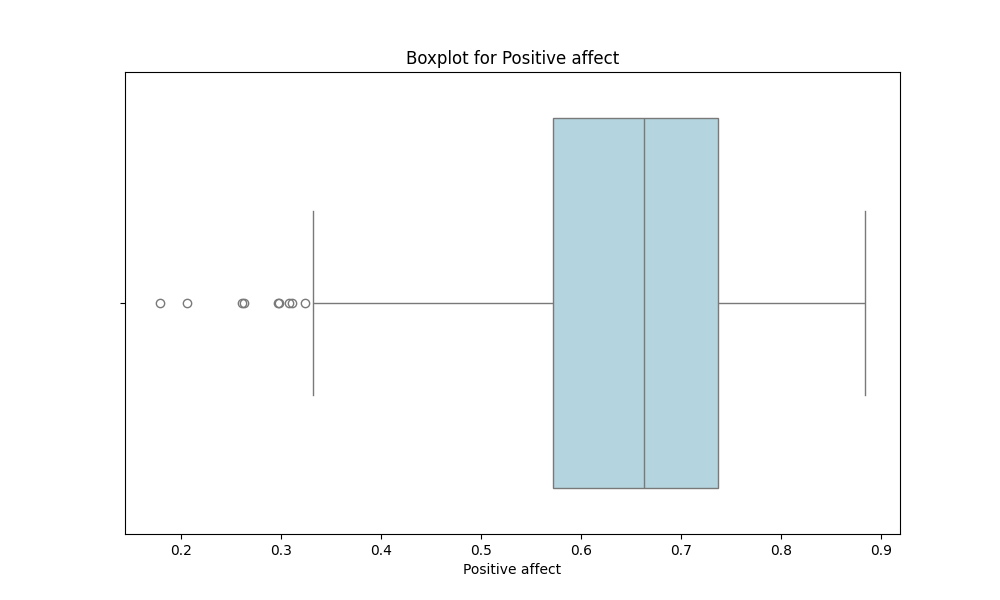
        
        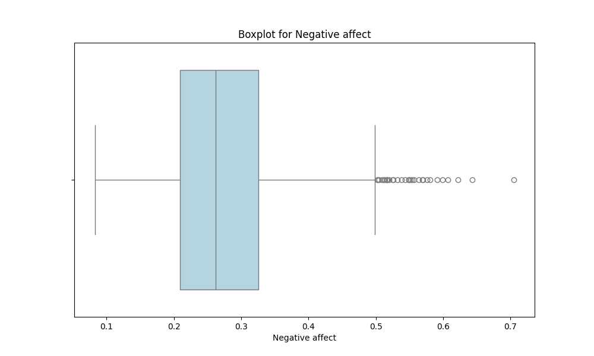
        
        