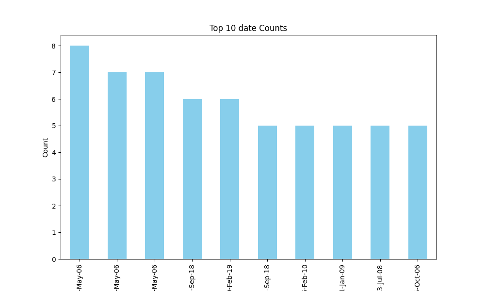
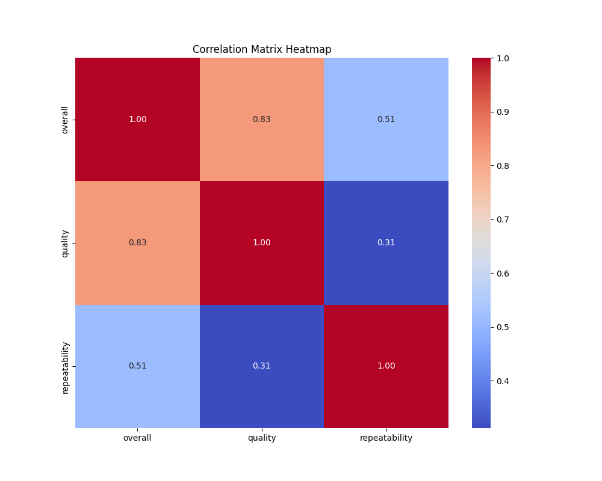
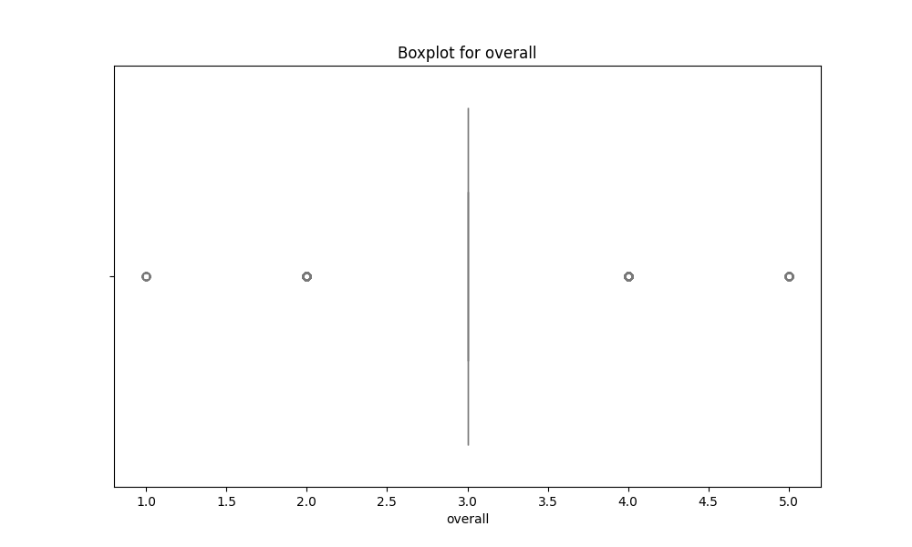
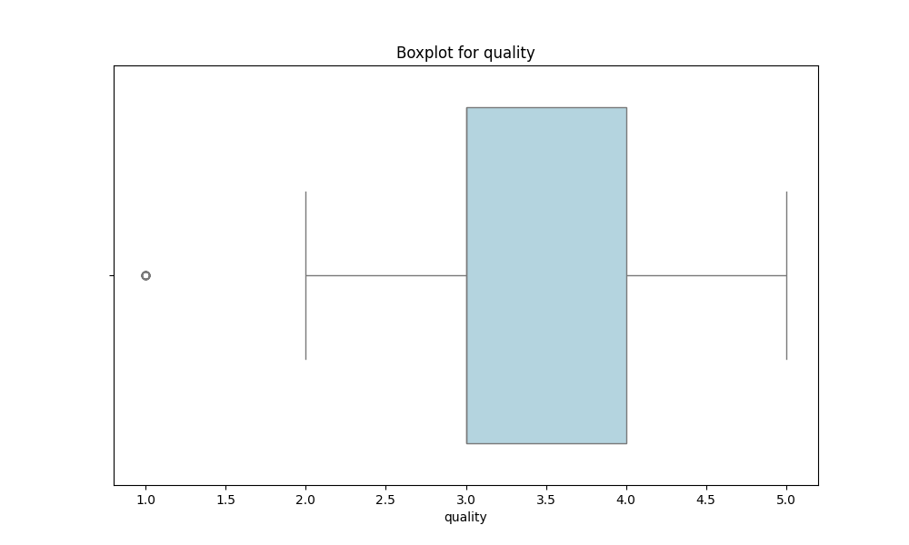
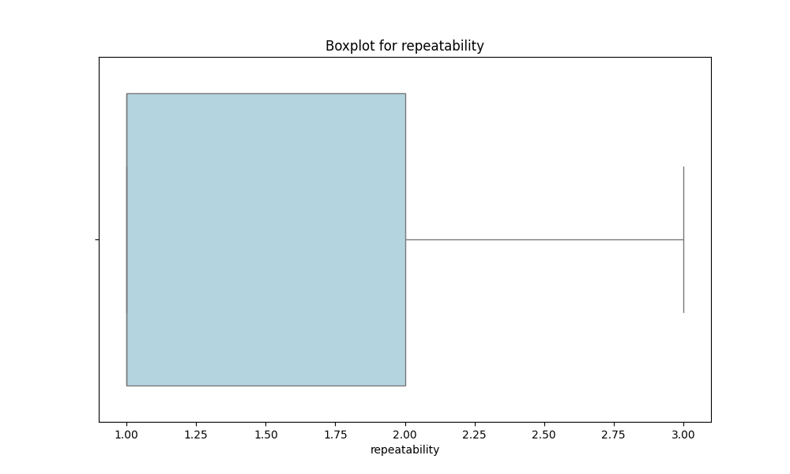

        # Automated Analysis Report

        ### Narrative Analysis

This dataset comprises 2,553 records detailing various attributes of media items, categorized by characteristics such as date, language, type, title, and creator (by), alongside performance metrics like overall ratings, quality, and repeatability. The structure of the dataset provides a rich canvas for exploration, revealing trends and patterns in media reception and performance. 

#### Key Insights:

1. **Temporal Distribution**: The dataset spans diverse dates, with the highest frequency for entries dated 21-May-06. Understanding how media reception changes over time can offer insights into evolving trends and audience preferences. 

2. **Language Diversity**: The dataset includes contributions in 11 different languages, highlighting a potential for cultural insights and the effectiveness of media across linguistic divides. However, the dominant language appears to be English, with 1,306 occurrences, indicating a potential bias towards English media in this dataset.

3. **Type Distribution**: There are eight different types of media documented, with "movie" being the most frequently recorded type (2,211 entries). This suggests a predominant interest in cinematic content over other types, such as series, documentaries, or short films.

4. **Rating Correlations**: The correlation matrix reveals a strong positive correlation (0.826) between the overall rating and quality score. This alignment suggests that higher-quality media tends to receive better overall ratings from viewers. Repeatability, while positively correlated with overall ratings (0.513), shows a weaker relationship with quality (0.312). These statistics hint at how audiences value quality in assessing overall performance while also considering other factors affecting repeat viewership.

5. **Missing Data**: The analysis identifies 99 missing values for the date and a notable 262 missing entries under the 'by' attribute. These gaps could skew data interpretations, particularly when analyzing trends or the impact of specific creators on media performance.

This dataset serves as a powerful resource for analyzing media reception patterns, especially in the context of preferences that could drive future content creation. Further investigation could yield insights into effective strategies for content producers and distributors.

### Suggested Visualizations:

1. **Time Series Plot**: Implement a line graph to visualize trends over time. This could display the number of entries and corresponding average ratings across years, showcasing how media consumption and reception have evolved.

2. **Bar Chart of Language Distribution**: A horizontal bar chart demonstrating the frequency of entries across the various languages would effectively highlight the diversity within the dataset. It would enable viewers to quickly discern which languages dominate and could lead into deeper discussions on media representation.

3. **Heatmap of Correlation Matrix**: A heatmap visualizing the correlation between the numerical columns (overall, quality, repeatability) will effectively communicate the strength and nature of these relationships. This would be especially useful for identifying how these ratings might interrelate and guide potential areas for more detailed investigations.

These visualizations will not only enhance the interpretability of the data but also assist in communicating essential insights to stakeholders interested in media performance analysis.

        
        
        
        
        
        
        
        
        
        
        
        